# [Homework #2](./hw_2_pset.pdf) – Numeric Computing
## Name: Tejas Harishchandra Acharya
## Date: 08/08/2025

### [Problem 1](./prob1/): Raman Spectroscopy
#### Raman Spectrograph
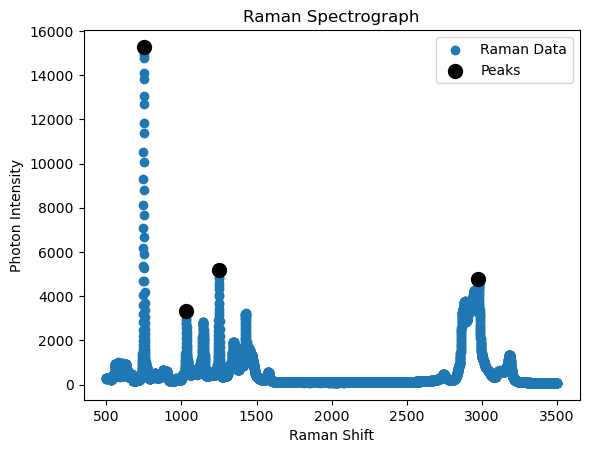

#### Wavenumber at Peak 1: 750.2256771428571 cm-1
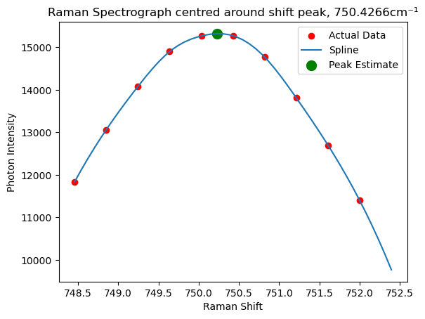

#### Wavenumber at Peak 2: 1031.8792428571428 cm-1
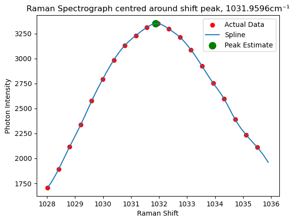

#### Wavenumber at Peak 3: 1250.982379591837 cm-1

#### Wavenumber at Peak 4: 2975.3128714285717 cm-1
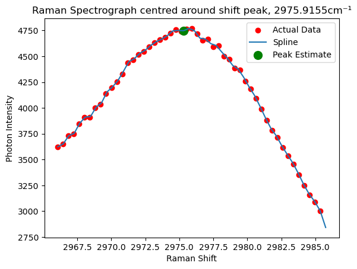

### [Problem 2(a)](./prob2/prob2_a/): K-Means
#### K-Means Labels
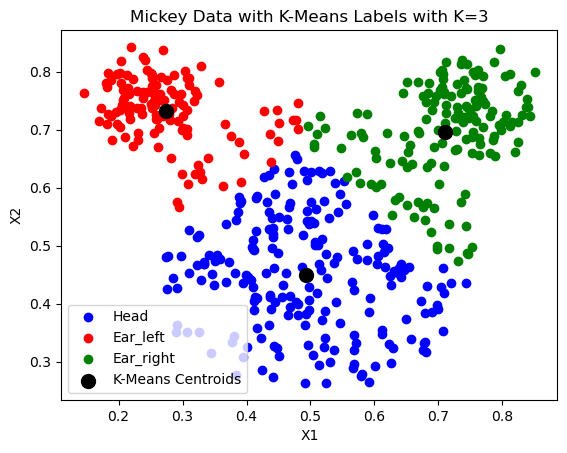

#### Confusion Matrix
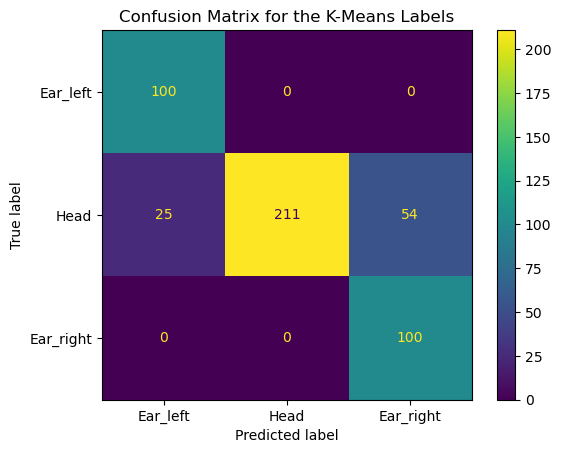

#### F-1 Score: 0.8406132723572086

### [Problem 2(b)](./prob2/prob2_b/): GMM
#### Labels after Iteration 0

#### Labels after Iteration 1
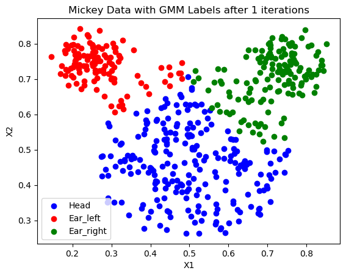

#### Labels after Iteration 2
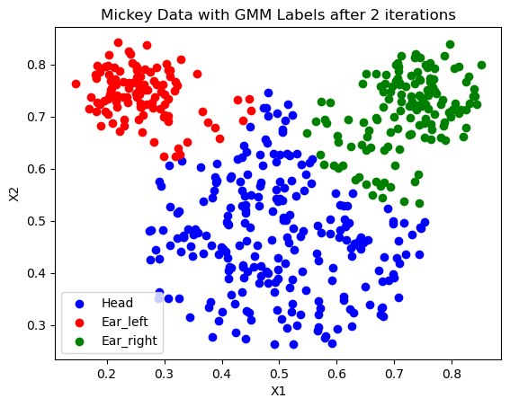

#### Labels after Iteration 3
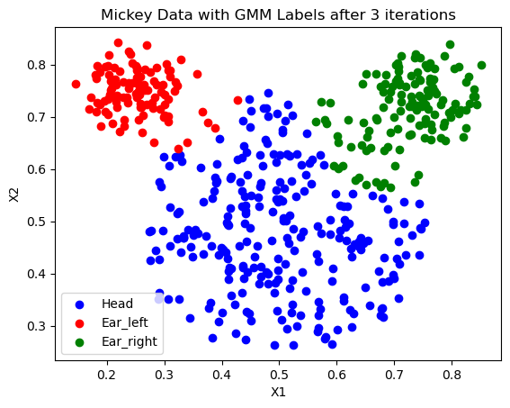

#### Labels after Convergence
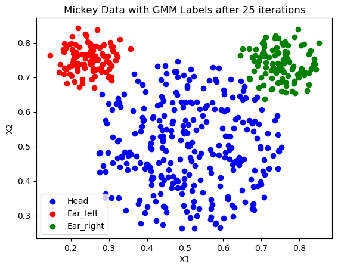

#### Confusion Matrix
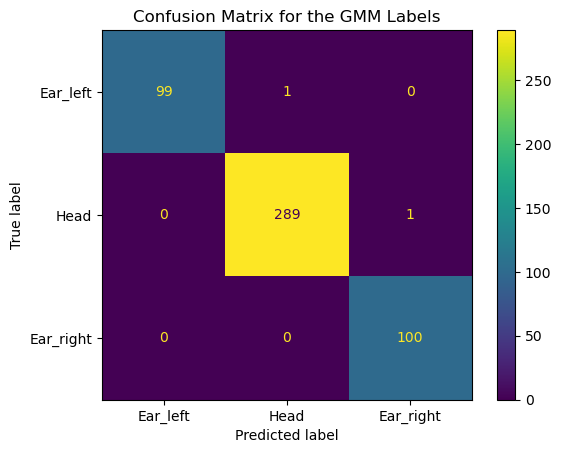

#### F-1 Score: 0.995918316325255

#### For the same dataset, GMM has a higher Weighted F-1 Score than K-Means, we can safely say that GMM has performed better than K-Means.
